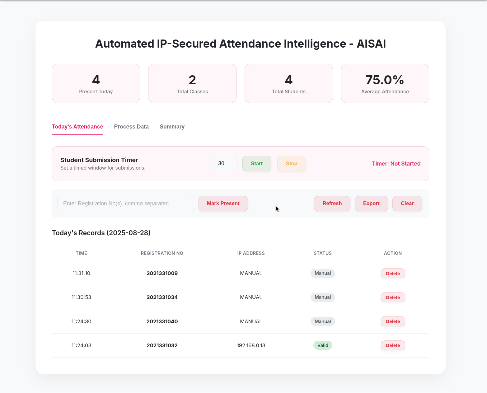

# Automated IP-Secured Attendance Intelligence - AISAI

---

---

## Project overview
Automated IP-Secured Attendance Intelligence (AISAI) prevents proxy attendance and removes manual record-keeping overhead by validating one submission per device (IP) inside a controlled Wi-Fi network. Teachers create short, configurable attendance sessions; students submit a registration number from their devices; AISAI validates by IP, aggregates results, computes attendance, and stores semester records securely.

---

## Key goals
-  Eliminate proxy attendance via IP validation (one submission per device)  
-  Automated marking and calculations for immediate results  
-  Intuitive dashboards for teachers and students  
-  Secure semester-long storage (SQLite3)  
-  Exportable, accreditation-ready reports

---

## Features
- Teacher admin dashboard: start/stop sessions, session duration control, live monitoring.  
- Student submission UI: fast single-field submission with live status.  
- IP-based validation to avoid duplicate submissions in controlled Wi-Fi.  
- Automated aggregation & grade calculation (triggered post-session).  
- Export CSV / Excel reports and semester archives.

---

## How it works (high level)
1. Teacher starts an attendance session (configurable window, e.g., 15–20 sec).  
2. Students on the same controlled Wi-Fi open the client page and submit their registration number.  
3. Server captures the requester IP and accepts a single valid submission per IP.  
4. Post session, a command/process aggregates results, computes attendance, and appends records to an SQLite database.  
5. Teachers download reports or view analytics on the dashboard.

---

## System architecture
**Modules**
- **Server (Python + Flask):** session control, IP validation, DB ops  
- **Client (Flask templates):** student submission interface  
- **Admin dashboard:** start sessions, monitor, and export

---

## Tech stack
- Python (Flask)  
- SQLite3  
- socket & threading (for local networking logic)  
- pandas (data processing)  
- Simple templated frontend (HTML/CSS + Flask Jinja)

---

## Security & privacy
- IP-based validation works **only** within a controlled campus Wi-Fi environment.  
- Student identifiers are stored securely in a local SQLite database for the semester.  
- For privacy and startup protection, the source code is **not public** in this repository.  
- **Source code is available on request** under NDA for collaborators or evaluators.

---

## For recruiters & evaluators
If you'd like to evaluate the codebase, a compiled demo, or collaborate:
- Email: **jidnehuda24@gmail.com**  
- LinkedIn: **https://www.linkedin.com/in/jidne24**  
Source review is available under NDA — please reference "AISAI source access" in your message.

---

### Star this repository if you find it useful!

**Developed with ❤️ by [Gidne Huda](https://github.com/jidne24)**

